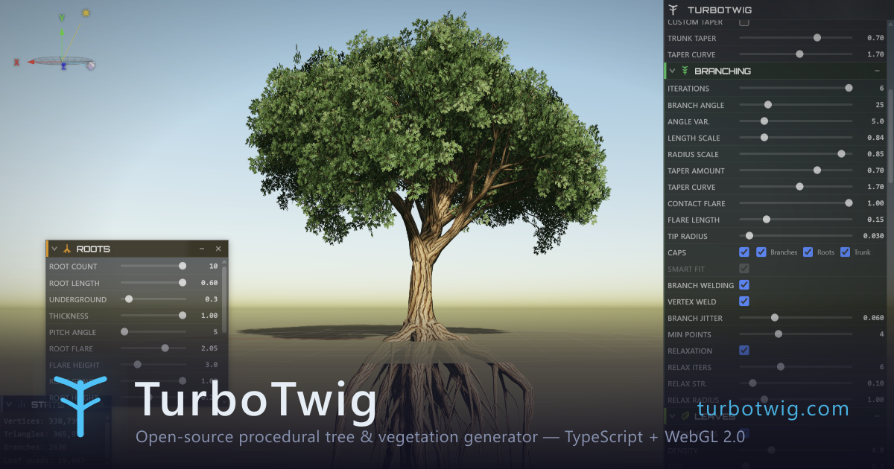

<div align="center">

# TurboTwig

**Open-source procedural tree and vegetation generator for the browser.**

TypeScript + WebGL 2.0 | [Live Demo](https://turbotwig.com)



</div>

TurboTwig generates realistic 3D trees using L-system grammars, turtle graphics, and mesh construction, all running in real time in the browser. Think SpeedTree, but free, hackable, web-native, and MIT-licensed.

## Features

- **L-system generation:** parametric production rules with species presets
- **Real-time rendering:** PBR materials, shadow mapping, and atmospheric scattering via WebGL 2.0
- **Wind animation:** trunk stiffness, branch flexibility, and leaf flutter
- **Branch collision avoidance:** iterative relaxation solver running in a Web Worker
- **Branch welding:** CSG operations (manifold-3d) for seamless junctions
- **Root generation:** configurable flare, gravity, and sub-roots
- **glTF/GLB export:** drop trees straight into game engines and 3D apps
- **Preset system:** broadleaf, conifer, and extensible species definitions
- **Dockable GUI:** per-parameter controls with save/load configs

## Getting Started

```bash
npm install
npm run dev
```

Opens a local dev server with HMR. Visit the URL shown in the terminal.

### Production Build

```bash
npm run build     # TypeScript check + Vite production build
npm run preview   # Preview the build locally
```

## Architecture

```
L-System → Turtle → Topology → Roots → Subdivision → Relaxation → Mesh → Leaves
                                                                          ↓
                                                                    WebGL 2.0 Renderer
```

| Module | Purpose |
|--------|---------|
| `src/core/lsystem/` | L-system string expansion, turtle interpretation, symbol parsing |
| `src/core/generation/` | Pipeline orchestration, branch subdivision and relaxation |
| `src/core/mesh/` | Tube mesh builder, leaf placement, root generation, branch welding |
| `src/core/wind/` | Wind animation parameters |
| `src/renderer/` | WebGL 2.0 renderer, shaders, camera, textures |
| `src/presets/` | Tree species definitions |
| `src/export/` | glTF 2.0 exporter and config serialization |
| `src/ui/` | Dockable window system, parameter controls, sidebar |
| `src/utils/` | Math primitives, seeded PRNG, spline interpolation |

## Tech Stack

**TypeScript** (strict) · **Vite** · **WebGL 2.0** with custom GLSL shaders · **Web Workers** · **manifold-3d** (WASM)

## License

MIT
